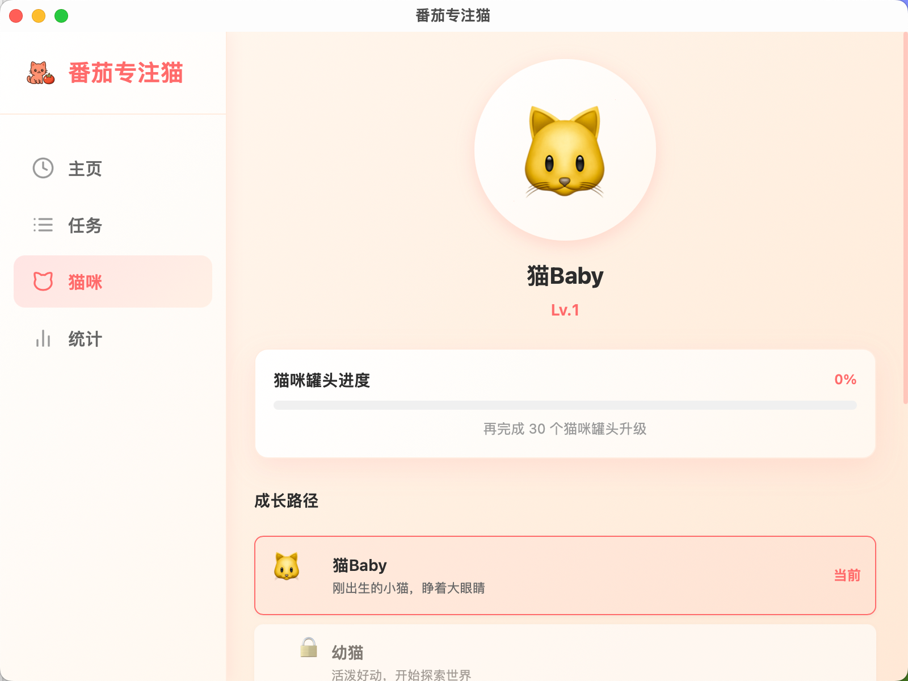
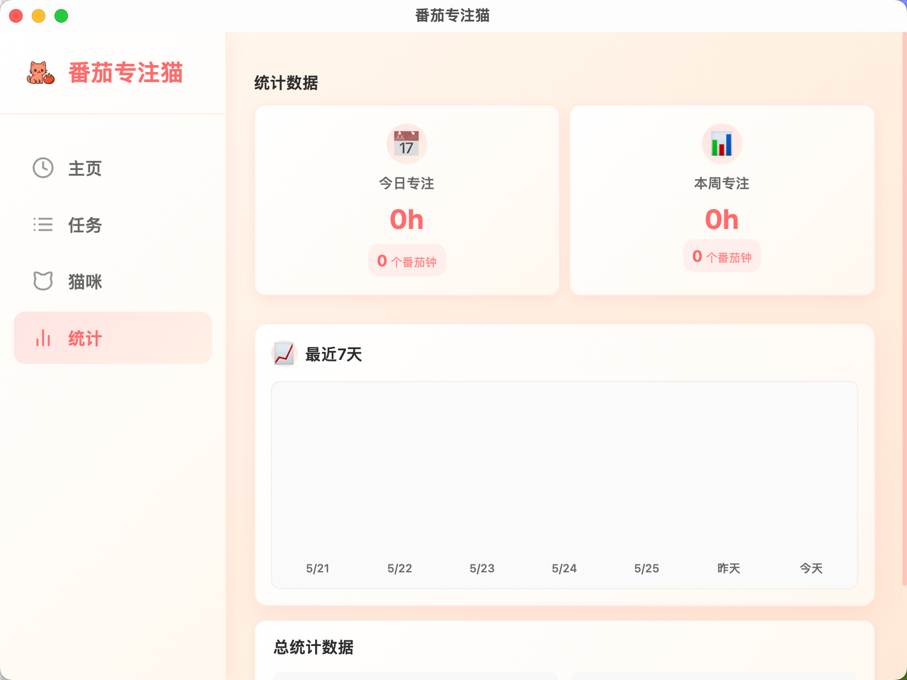

<div align="center">

  

  # 🍅 番茄专注猫 (Pomodoro Cat)

  **一款可爱的跨平台番茄钟应用，通过虚拟猫咪成长来游戏化你的生产力**

  [](https://opensource.org/licenses/MIT)
  [](https://tauri.app/)
  [](https://react.dev/)
  [](https://www.rust-lang.org/)

  [English](#english) | [中文](#中文)

</div>

---

## 中文

### ✨ 特性

- ⏱️ **番茄钟计时器** - 可自定义专注和休息时长（默认 25/5 分钟）
- 🐱 **猫咪养成系统** - 完成番茄钟获得罐头，猫咪会不断进化升级
- 📝 **任务管理** - 创建和管理任务，为每个任务设置番茄目标
- 📊 **统计分析** - 可视化展示你的专注记录和统计数据
- 🎨 **简洁美观的 UI** - 使用 Tailwind CSS 构建的现代化界面
- 🖥️ **跨平台支持** - 支持 macOS、Windows 和 Linux
- 📱 **macOS 菜单栏图标** - 方便的菜单栏快捷操作（仅 macOS）
- 💾 **本地数据存储** - 所有数据存储在本地 SQLite 数据库中
- 🧪 **测试模式** - 开发者可开启 1 分钟快速测试模式

### 🎯 应用截图

<div align="center">
  
  <p><em>主界面 - 番茄钟计时器</em></p>
  
  
  <p><em>任务管理 - 为每个任务设置番茄目标</em></p>
  
  
  <p><em>猫咪养成 - 看着你的虚拟猫咪成长</em></p>
  
  
  <p><em>数据统计 - 可视化你的专注记录</em></p>
</div>

### 🛠️ 技术栈

**前端**
- [React 19](https://react.dev/) - UI 框架
- [TypeScript](https://www.typescriptlang.org/) - 类型安全
- [Tailwind CSS v4](https://tailwindcss.com/) - 样式框架
- [Zustand](https://github.com/pmndrs/zustand) - 状态管理
- [React Router](https://reactrouter.com/) - 路由管理
- [Recharts](https://recharts.org/) - 数据可视化

**后端**
- [Tauri 2](https://tauri.app/) - 跨平台桌面应用框架
- [Rust](https://www.rust-lang.org/) - 系统编程语言
- [SQLite](https://www.sqlite.org/) - 嵌入式数据库
- [rusqlite](https://github.com/rusqlite/rusqlite) - Rust SQLite 绑定

### 📦 安装

#### 从预构建版本安装（推荐）

1. 前往 [Releases](https://github.com/yourusername/pomodoro-cat-tauri/releases) 页面
2. 下载适合你操作系统的安装包
3. 安装并运行应用

#### 从源码构建

**前置要求**

- Node.js 18+
- Rust 1.70+ 和 Cargo
- 系统依赖（根据操作系统）

**macOS**
```bash
# 安装 Rust
curl --proto '=https' --tlsv1.2 -sSf https://sh.rustup.rs | sh

# 克隆项目
git clone https://github.com/yourusername/pomodoro-cat-tauri.git
cd pomodoro-cat-tauri

# 安装依赖
npm install

# 运行开发模式
npm run tauri dev

# 构建生产版本
npm run tauri build
```

**Windows**
```bash
# 安装 Rust: https://www.rust-lang.org/tools/install

# 克隆项目
git clone https://github.com/yourusername/pomodoro-cat-tauri.git
cd pomodoro-cat-tauri

# 安装依赖
npm install

# 运行开发模式
npm run tauri dev

# 构建生产版本
npm run tauri build
```

**Linux**
```bash
# 安装 Rust
curl --proto '=https' --tlsv1.2 -sSf https://sh.rustup.rs | sh

# 安装系统依赖（Ubuntu/Debian）
sudo apt update
sudo apt install libwebkit2gtk-4.1-dev \
  build-essential \
  curl \
  wget \
  file \
  libxdo-dev \
  libssl-dev \
  libayatana-appindicator3-dev \
  librsvg2-dev

# 克隆项目
git clone https://github.com/yourusername/pomodoro-cat-tauri.git
cd pomodoro-cat-tauri

# 安装依赖
npm install

# 运行开发模式
npm run tauri dev

# 构建生产版本
npm run tauri build
```

### 🚀 使用指南

1. **开始番茄钟** - 点击主界面的"开始专注"按钮
2. **管理任务** - 在"任务"页面创建和管理你的待办事项
3. **查看猫咪** - 在"猫咪"页面查看你的虚拟猫咪成长进度
4. **统计数据** - 在"统计"页面查看你的专注记录和图表
5. **调整设置** - 在"设置"页面自定义专注/休息时长和其他偏好

### 🧪 测试模式

开发过程中可以开启测试模式，将专注和休息时间缩短为 1 分钟：

1. 进入"设置"页面
2. 启用"测试模式"开关
3. 完成番茄钟后，记录的时间仍为标准的 25 分钟

⚠️ 注意：测试模式仅供开发使用，不会影响实际统计数据的准确性。

### 🤝 贡献指南

我们欢迎任何形式的贡献！

1. Fork 本项目
2. 创建你的特性分支 (`git checkout -b feature/AmazingFeature`)
3. 提交你的更改 (`git commit -m 'Add some AmazingFeature'`)
4. 推送到分支 (`git push origin feature/AmazingFeature`)
5. 开启一个 Pull Request

请确保你的代码遵循项目的代码风格，并包含必要的测试。

### 📄 许可证

本项目采用 MIT 许可证 - 详见 [LICENSE](LICENSE) 文件

### 🙏 致谢

- [Tauri](https://tauri.app/) - 强大的跨平台桌面应用框架
- [React](https://react.dev/) - 用于构建用户界面的 JavaScript 库
- [Tailwind CSS](https://tailwindcss.com/) - 实用优先的 CSS 框架
- 所有贡献者

---

## English

### ✨ Features

- ⏱️ **Pomodoro Timer** - Customizable focus and break durations (default 25/5 minutes)
- 🐱 **Cat Growth System** - Earn cans by completing pomodoros and watch your cat evolve
- 📝 **Task Management** - Create and manage tasks with pomodoro goals
- 📊 **Statistics** - Visualize your focus records and productivity data
- 🎨 **Clean and Beautiful UI** - Modern interface built with Tailwind CSS
- 🖥️ **Cross-platform Support** - Works on macOS, Windows, and Linux
- 📱 **macOS Menu Bar Icon** - Quick access from menu bar (macOS only)
- 💾 **Local Data Storage** - All data stored locally in SQLite database
- 🧪 **Test Mode** - Enable 1-minute quick test mode for development

### 🎯 Screenshots

<div align="center">
  
  <p><em>Main Interface - Pomodoro Timer</em></p>
  
  
  <p><em>Task Management - Set pomodoro goals for each task</em></p>
  
  
  <p><em>Cat Growth - Watch your virtual cat evolve</em></p>
  
  
  <p><em>Statistics - Visualize your focus records</em></p>
</div>

### 🛠️ Tech Stack

**Frontend**
- [React 19](https://react.dev/) - UI framework
- [TypeScript](https://www.typescriptlang.org/) - Type safety
- [Tailwind CSS v4](https://tailwindcss.com/) - Styling
- [Zustand](https://github.com/pmndrs/zustand) - State management
- [React Router](https://reactrouter.com/) - Routing
- [Recharts](https://recharts.org/) - Data visualization

**Backend**
- [Tauri 2](https://tauri.app/) - Cross-platform framework
- [Rust](https://www.rust-lang.org/) - Systems programming
- [SQLite](https://www.sqlite.org/) - Embedded database
- [rusqlite](https://github.com/rusqlite/rusqlite) - Rust SQLite bindings

### 📦 Installation

#### Install from Pre-built Release (Recommended)

1. Go to [Releases](https://github.com/yourusername/pomodoro-cat-tauri/releases)
2. Download the installer for your operating system
3. Install and run the application

#### Build from Source

**Prerequisites**
- Node.js 18+
- Rust 1.70+ and Cargo
- System dependencies (varies by OS)

**macOS**
```bash
# Install Rust
curl --proto '=https' --tlsv1.2 -sSf https://sh.rustup.rs | sh

# Clone project
git clone https://github.com/yourusername/pomodoro-cat-tauri.git
cd pomodoro-cat-tauri

# Install dependencies
npm install

# Run dev mode
npm run tauri dev

# Build production
npm run tauri build
```

**Windows**
```bash
# Install Rust: https://www.rust-lang.org/tools/install

# Clone project
git clone https://github.com/yourusername/pomodoro-cat-tauri.git
cd pomodoro-cat-tauri

# Install dependencies
npm install

# Run dev mode
npm run tauri dev

# Build production
npm run tauri build
```

**Linux**
```bash
# Install Rust
curl --proto '=https' --tlsv1.2 -sSf https://sh.rustup.rs | sh

# Install system dependencies (Ubuntu/Debian)
sudo apt update
sudo apt install libwebkit2gtk-4.1-dev \
  build-essential \
  curl \
  wget \
  file \
  libxdo-dev \
  libssl-dev \
  libayatana-appindicator3-dev \
  librsvg2-dev

# Clone project
git clone https://github.com/yourusername/pomodoro-cat-tauri.git
cd pomodoro-cat-tauri

# Install dependencies
npm install

# Run dev mode
npm run tauri dev

# Build production
npm run tauri build
```

### 🚀 Usage Guide

1. **Start Pomodoro** - Click "开始专注" (Start Focus) button on main screen
2. **Manage Tasks** - Create and manage todos on "任务" (Tasks) page
3. **View Cat** - Check your virtual cat's progress on "猫咪" (Cat) page
4. **Statistics** - View focus records and charts on "统计" (Stats) page
5. **Settings** - Customize focus/break duration and preferences on "设置" (Settings) page

### 🧪 Test Mode

Enable test mode during development to reduce focus and break time to 1 minute:

1. Go to "设置" (Settings) page
2. Enable "测试模式" (Test Mode) toggle
3. Completed pomodoros will still be recorded as standard 25 minutes

⚠️ Note: Test mode is for development only and won't affect the accuracy of actual statistics.

### 🤝 Contributing

Contributions are welcome!

1. Fork the project
2. Create your feature branch (`git checkout -b feature/AmazingFeature`)
3. Commit your changes (`git commit -m 'Add some AmazingFeature'`)
4. Push to the branch (`git push origin feature/AmazingFeature`)
5. Open a Pull Request

Please ensure your code follows the project's code style and includes necessary tests.

### 📄 License

This project is licensed under the MIT License - see the [LICENSE](LICENSE) file for details

### 🙏 Acknowledgments

- [Tauri](https://tauri.app/) - Amazing cross-platform framework
- [React](https://react.dev/) - Great UI library
- [Tailwind CSS](https://tailwindcss.com/) - Excellent CSS framework
- All contributors

---

<div align="center">

**如果这个项目对你有帮助，请给个 ⭐️ Star！**

**If this project helps you, please give it a ⭐️ Star!**

</div>
